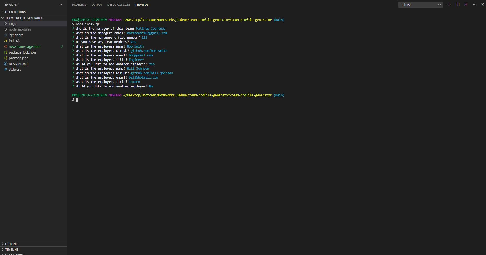
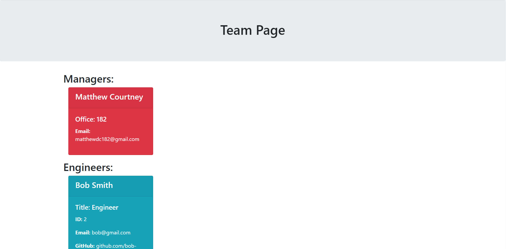

# Team Profile Generator

## Purpose
I am currently redoing all of the course work from the bootcamp I attended earlier this year. This was actually a homework assignment that we were not required to complete. This was fun because I was going into it with zero prior experience and no one to refer to for questions. We had no demos in the video files since it was not a required homework. The idea was to create a CLI app that takes a managers input and develops a team page based on the input.

## Process
This project was pretty trcky. The idea was simple enough but it really required an in depth understanding of passing arguments, nesting functions, asynchronization, amd call backs. Since we learned ES6 syntax in this chapter I tried to use it as best I could. The project started out easy enough but I built it piece by piece and while they all worked on their own weaving them together was where the problem lie. I was very happy to overcome the obstacle and have a working app. 

## Languages 
JavaScript 
<br>
HTML 
<br>
CSS 

## Links
[GitHub](https://github.com/sharkattack182/team-profile-generator)
<br>
To download this file please click the green code button above.
<br>
```
npm install
node index.js
```

## Visuals

<br>

<br>

